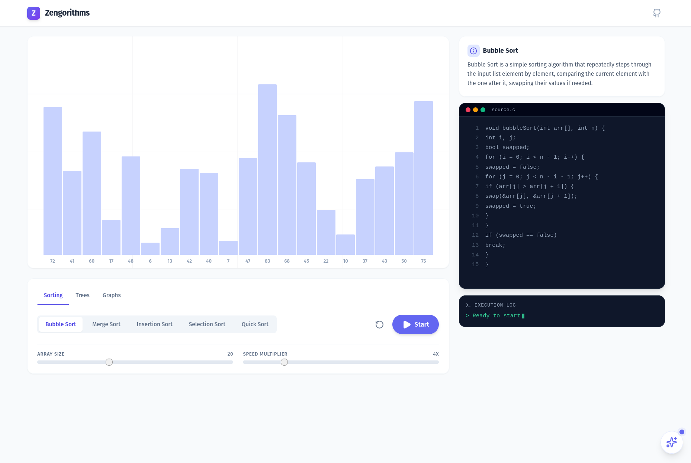

# Zengorithms 🧘‍♂️

A minimal, soothing, and intelligent algorithm visualizer designed to help you understand complex data structures and algorithms through beautiful animations and AI assistance.



## ✨ Features

- **Soothing UI**: A "Zen" design philosophy using calming colors (Indigo, Slate, Emerald) and smooth CSS transitions to make learning stress-free.
- **Multi-Category Support**: Visualizes **Sorting**, **Binary Search Trees**, and **Graph** algorithms.
- **Code Walkthrough**: Highlights the exact line of C-style code being executed in real-time.
- **AI Tutor**: Integrated **Gemini AI** assistant that answers questions about the current algorithm and state of the visualization.
- **Interactive Controls**: Play, pause, step-through, and adjustable speed/size controls.
- **Responsive**: Works on desktop and tablet sizes.

## 🚀 Supported Algorithms

### Sorting
- **Bubble Sort**: The classic stepping stone.
- **Merge Sort**: Divide and conquer visualization.
- **Insertion Sort**: Building the sorted list one item at a time.
- **Selection Sort**: Finding the minimum and placing it.
- **Quick Sort**: Partitioning logic visualization.

### Trees
- **Binary Search Tree (BST)**: Construction and insertion.
- **Traversals**: Preorder, Inorder, Postorder, and Level Order (BFS).

### Graphs
- **Dijkstra's Algorithm**: Pathfinding with priority queues.
- **BFS & DFS**: Graph traversal visualization.
- **Prim's & Kruskal's**: Minimum Spanning Tree (MST) algorithms.

## 🛠️ Tech Stack

- **Frontend**: React 19, TypeScript
- **Styling**: Tailwind CSS
- **Icons**: Lucide React
- **AI Integration**: Google Gemini 2.5 Flash
- **Build Tool**: Vite

## 💻 Getting Started Locally

Follow these steps to run Zengorithms on your local machine.

### Prerequisites
- Node.js (v18 or higher)
- npm or yarn

### 1. Clone the repository
```bash
git clone https://github.com/Moeez404/zengorithms.git
cd zengorithms
```

### 2. Install dependencies
```bash
npm install
# or
yarn install
```

### 3. Configure API Key
To use the AI Tutor feature, you need a Google Gemini API key.

1. Get a key from Google.
2. Create a file named `.env` in the root directory.
3. Add the following line:

```env
API_KEY=your_actual_api_key_here
```

> **Note**: If you are using Vite, you may need to prefix variables with `VITE_` and access them via `import.meta.env` depending on your specific bundler configuration. The current codebase expects `process.env.API_KEY` via a define plugin or similar bundler replacement.

### 4. Run the development server
```bash
npm run dev
# or
yarn dev
```

Open your browser and navigate to `http://localhost:5173` (or the port shown in your terminal).

## 🎮 How to Use

1. **Select a Category**: Choose between Sorting, Trees, or Graphs in the control panel.
2. **Pick an Algorithm**: Click on the specific algorithm you want to visualize.
3. **Adjust Settings**: Use the sliders to change the array size or animation speed.
4. **Controls**: Press **Start** to begin. You can **Pause** at any time.
5. **Ask AI**: Click the ✨ sparkles icon in the bottom right to open the AI Tutor. It knows context about what algorithm you are viewing!

## 📄 License

This project is open source and available under the [MIT License](LICENSE).
